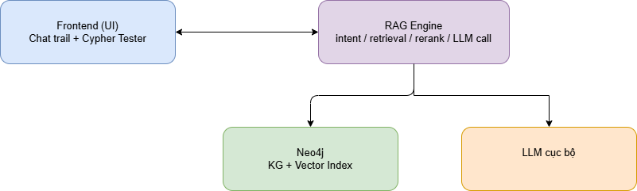
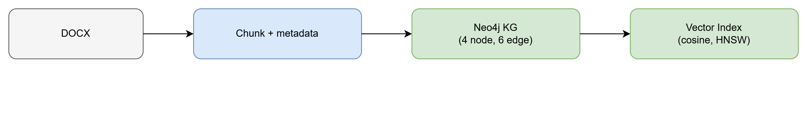
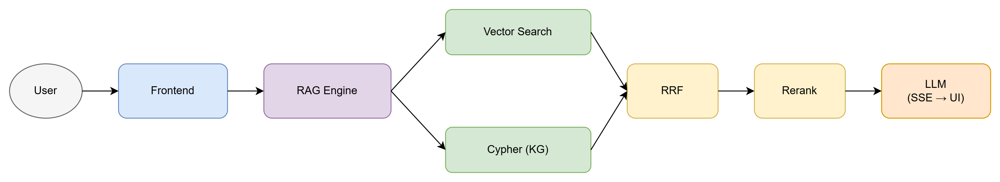
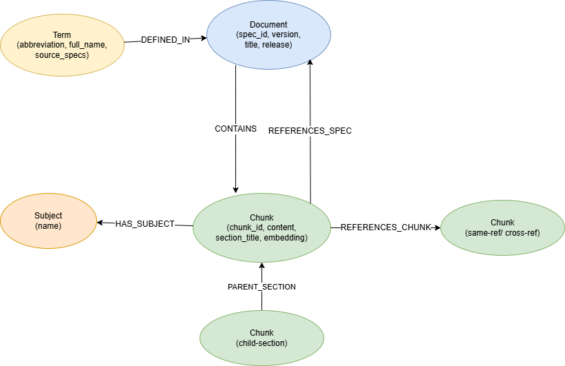
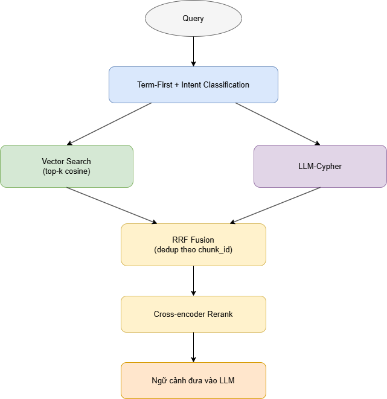
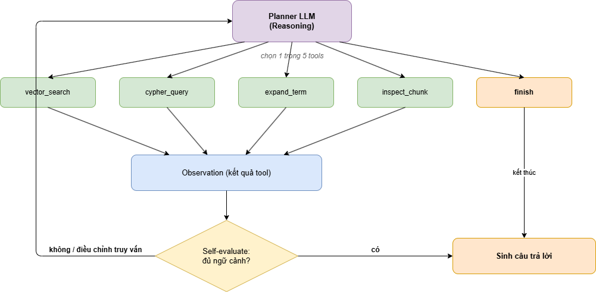
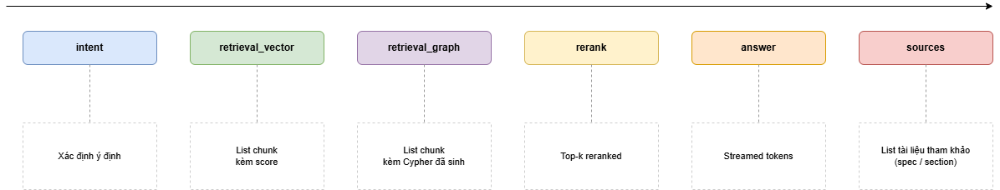
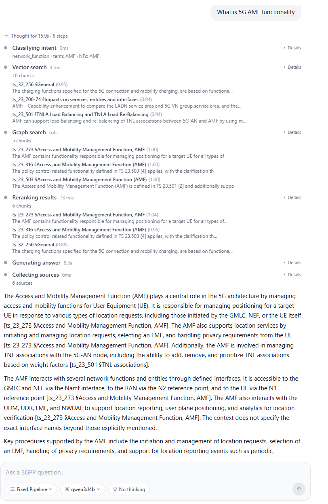

# ASK_3GPP

Hệ thống Hỏi-Đáp (RAG + Knowledge Graph) trên tài liệu đặc tả 3GPP.

Pipeline kết hợp **vector search** (embedding `e5-base-v2`), **graph
search** (Neo4j Cypher do LLM sinh) và **cross-encoder rerank** để trả
lời câu hỏi kỹ thuật về 5G/4G specs với citation tới `spec_id` và
`section`.

## Kiến trúc

Sơ đồ kiến trúc tổng thể:



Build-time (DOCX → JSON → Neo4j KG):



Query-time (câu hỏi → retrieval → rerank → answer):



Các module chính:

- **`document_processing/`** — pipeline 1 file: download → extract DOCX → chunk → JSON.
- **`kg_builder/`** — load JSON vào Neo4j + sinh embedding/vector index.
- **`rag-engine/`** — FastAPI `:8000`, expose `POST /api/query` (SSE) và `POST /api/cypher` (read-only Cypher tester).
- **`frontend/`** — Vite + React UI, port `:3000`.

### Sơ đồ Knowledge Graph



### Hai chế độ retrieval

**`fixed`** — vector + LLM-generated Cypher → RRF fusion → cross-encoder rerank:



**`react_agent`** — adaptive ReAct loop, planner LLM mỗi vòng chọn tool
trong `vector | cypher | expand_term | inspect_chunk | finish`:



### UI flow



Ví dụ giao diện trả lời câu hỏi:



## External services

- **Neo4j** — Docker container, ports `7474` / `7687`.
- **Ollama** — chạy local, cấu hình qua `OLLAMA_URL`.

`.env` ở repo root chứa `NEO4J_*`, `OLLAMA_URL`, `RAG_ENGINE_URL`.

## Setup

```bash
# Node deps cho root + frontend
npm run install:all

# Python venv
python -m venv venv
source venv/bin/activate
pip install -r document_processing/requirements.txt fastapi uvicorn python-dotenv \
    sentence-transformers neo4j tqdm requests
```

## Chạy hệ thống

```bash
npm run dev      # rag (8000) + frontend (3000) + cloudflared tunnel
npm run stop     # dừng toàn bộ
```

Service riêng:

```bash
npm run dev:rag        # FastAPI :8000
npm run dev:frontend   # Vite :3000
npm run dev:tunnel     # cloudflared
```

## Build / rebuild Knowledge Graph

```bash
npm run rebuild-kg                  # full: clean + KG + embeddings
npm run rebuild-kg:kg-only          # graph only
npm run rebuild-kg:embed-only       # chỉ embed lại
```

Re-chunk DOCX → JSON mới (không re-download):

```bash
python document_processing/download_and_process_3gpp.py process-local \
  --input  document_processing/data/rel18_extracted \
  --output 3GPP_JSON_DOC/processed_json_v4
```

## Test

```bash
npm test                                          # toàn bộ
npm run test:kg                                   # chỉ KG builder
npm run test:embed                                # chỉ embedder
pytest tests/test_kg_builder.py::test_xyz -v      # 1 test
```

## Benchmark Results

[TeleQnA Benchmark](tests/benchmark/500question_qwen3/) — 400 câu hỏi (loại Research publications) trên 4 category.

**Overall: 76.0% (304/400) | Model: qwen3:14b | Mode: fixed | Avg latency: 5566 ms**

| Category                 | Questions | Correct | Accuracy   |
|--------------------------|:---------:|:-------:|:----------:|
| Lexicon                  | 100       | 87      | **87.00%** |
| Standards specifications | 100       | 76      | 76.00%     |
| Research overview        | 100       | 73      | 73.00%     |
| Standards overview       | 100       | 68      | 68.00%     |

Graph search succeeded: 313/400 (78.2%) — không có graph search error.

## Thư mục chính

```
ASK_3GPP/
├── 3GPP_JSON_DOC/          # JSON đã chunk
├── document_processing/    # DOCX → JSON pipeline
├── kg_builder/             # JSON → Neo4j
├── rag-engine/             # FastAPI + retrieval pipeline
├── frontend/               # Vite + React UI
├── tests/                  # Unit + integration test
├── scripts/                # start-deps, stop, rebuild-kg
└── img/                    # Diagrams
```
