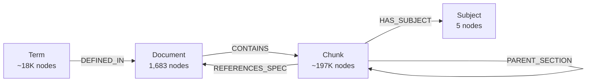
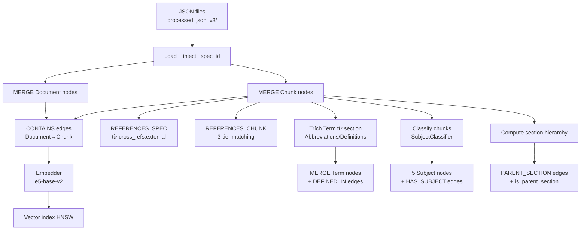

# Knowledge Graph — Schema

Tài liệu mô tả schema của Knowledge Graph trong demo: 4 loại đỉnh + 6 loại cạnh.
Schema được build bởi [`kg_builder/builder.py`](../kg_builder/builder.py) từ JSON đã pre-process.

## Tổng quan



## Node Labels

### `Document` — Tài liệu 3GPP

| Property | Type | Mô tả |
|---|---|---|
| `spec_id` | string | **UNIQUE** — định danh spec, ví dụ `ts_23_501` |
| `title` | string | Tiêu đề đầy đủ, ví dụ `"3GPP TS 23.501 — System architecture for 5G"` |
| `version` | string | Phiên bản, ví dụ `"18.0.0"` |
| `total_chunks` | int | Số chunks trong document |

### `Chunk` — Đoạn văn đã chia nhỏ

| Property | Type | Mô tả |
|---|---|---|
| `chunk_id` | string | **UNIQUE** — định danh chunk, ví dụ `ts_23_501_4.2.1` |
| `spec_id` | string | INDEX — spec_id của document chứa chunk |
| `section_id` | string | INDEX — số section, ví dụ `"4.2.1"` |
| `section_title` | string | Tiêu đề section |
| `content` | string | Nội dung text |
| `chunk_type` | string | INDEX — `definition`, `procedure`, `general`, `abbreviation`, `reference`, ... |
| `embedding` | vector(768) | Vector e5-base-v2 (cosine similarity, HNSW index) |
| `word_count` | int | Số từ |
| `complexity_score` | float | Độ phức tạp text (0–1) |
| `key_terms` | list&lt;string&gt; | Thuật ngữ chính trong chunk |
| `subject` | string | Tên Subject (denormalized) |
| `subject_confidence` | float | Confidence của subject classification |
| `is_parent_section` | bool | True nếu chunk có ít nhất 1 con (theo section hierarchy) |

### `Term` — Thuật ngữ viết tắt / định nghĩa

| Property | Type | Mô tả |
|---|---|---|
| `abbreviation` | string | **UNIQUE** — viết tắt, ví dụ `"AMF"` |
| `full_name` | string | Tên đầy đủ, ví dụ `"Access and Mobility Management Function"` |
| `term_type` | string | `abbreviation` hoặc `definition` |
| `source_specs` | list&lt;string&gt; | Tất cả spec_id chứa định nghĩa term này (gold pattern cho retrieval) |
| `primary_spec` | string | Spec ưu tiên (5G > legacy) |

### `Subject` — Phân loại chủ đề (taxonomy cố định)

| Property | Type | Mô tả |
|---|---|---|
| `name` | string | **UNIQUE** — tên Subject |
| `priority` | int | 1–5 (1 = ưu tiên cao nhất khi conflict) |
| `description` | string | Mô tả ngắn |

**5 Subject:**

| Priority | Name | Mô tả |
|---:|---|---|
| 1 | Standards specifications | Procedures, IEs, messages cụ thể |
| 2 | Standards overview | Architecture, overview, introduction |
| 3 | Lexicon | Abbreviations, definitions, terminology |
| 4 | Research publications | Algorithms, techniques, methods |
| 5 | Research overview | General concepts, surveys |

## Relationship Types

### `CONTAINS` — Document → Chunk
Tài liệu chứa chunks. Match theo `Document.spec_id = Chunk.spec_id`.

```cypher
MATCH (d:Document {spec_id: 'ts_23_501'})-[:CONTAINS]->(c:Chunk)
RETURN c LIMIT 5
```

### `REFERENCES_SPEC` — Chunk → Document
Chunk tham chiếu chéo sang spec khác. Lấy từ `cross_references.external` trong JSON.

| Property | Mô tả |
|---|---|
| `ref_id` | ID tham chiếu, ví dụ `"4.2.3"` |
| `ref_type` | Loại: `spec`, `clause`, `figure`, ... |
| `confidence` | 0–1 |
| `ref_uid` | Hash unique để MERGE idempotent |

### `REFERENCES_CHUNK` — Chunk → Chunk
Cross-reference nội bộ trong cùng spec. Match `ref_id` với `section_id` qua **3-tier matching**:

1. **Exact:** `ref_id` = `section_id` (e.g. ref `"3.1"` → section `"3.1"`)
2. **Prefix:** ref là prefix của section (e.g. ref `"5.2"` → section `"5.2.1"`)
3. **Parent:** strip suffix `-N` (e.g. ref `"5.2.3-1"` → section `"5.2.3"`)

Self-reference fallback xuống tier kế tiếp.

### `DEFINED_IN` — Term → Document
Term được định nghĩa trong spec. Tạo từ chunk có section_title chứa "Abbreviations" hoặc "Definitions".

> **Lưu ý:** Pattern truy xuất production thực ra **không** dùng cạnh này, mà dùng `c.spec_id IN t.source_specs` (property list trên Term node) vì hiệu quả hơn.

### `HAS_SUBJECT` — Chunk → Subject
Mỗi chunk có đúng 1 HAS_SUBJECT, được phân loại bởi `SubjectClassifier` theo keyword + chunk_type.

### `PARENT_SECTION` — Chunk → Chunk *(NEW)*
Section hierarchy. Edge từ section con đến section cha **gần nhất** (không nhảy cấp).

Ví dụ: chunk `4.2.1.1` → `4.2.1` (không trỏ thẳng đến `4.2`).

```cypher
// Lấy toàn bộ con cháu của section 4.2
MATCH (root:Chunk {spec_id: 'ts_23_501', section_id: '4.2'})
MATCH path = (descendant:Chunk)-[:PARENT_SECTION*]->(root)
RETURN descendant
```

## Constraints & Indexes

```cypher
-- Uniqueness constraints
CREATE CONSTRAINT FOR (d:Document) REQUIRE d.spec_id      IS UNIQUE;
CREATE CONSTRAINT FOR (c:Chunk)    REQUIRE c.chunk_id     IS UNIQUE;
CREATE CONSTRAINT FOR (t:Term)     REQUIRE t.abbreviation IS UNIQUE;
CREATE CONSTRAINT FOR (s:Subject)  REQUIRE s.name         IS UNIQUE;

-- Indexes (tốc độ filter)
CREATE INDEX FOR (c:Chunk) ON (c.spec_id);
CREATE INDEX FOR (c:Chunk) ON (c.chunk_type);
CREATE INDEX FOR (c:Chunk) ON (c.section_id);

-- Vector index (HNSW, cosine)
CREATE VECTOR INDEX chunk_embeddings FOR (c:Chunk) ON (c.embedding)
OPTIONS {indexConfig: {`vector.dimensions`: 768, `vector.similarity_function`: 'cosine'}};
```

## Pipeline build



## Truy vấn mẫu (gold patterns)

### 1. Lookup theo Term (Term-First)

```cypher
// Tìm chunks định nghĩa AMF
MATCH (t:Term {abbreviation: 'AMF'})
MATCH (c:Chunk) WHERE c.spec_id IN t.source_specs
  AND c.chunk_type IN ['abbreviation', 'definition']
RETURN c, t.full_name
LIMIT 10
```

### 2. Filter theo Subject + intent

```cypher
// Chunks về procedure trong Standards specifications
MATCH (c:Chunk)-[:HAS_SUBJECT]->(s:Subject {name: 'Standards specifications'})
WHERE c.chunk_type = 'procedure'
RETURN c LIMIT 10
```

### 3. Multi-hop traversal

```cypher
// Từ chunk A, expand qua REFERENCES_CHUNK 1-2 hops
MATCH (start:Chunk {chunk_id: 'ts_23_501_4.2.1'})
MATCH path = (start)-[:REFERENCES_CHUNK*1..2]->(related:Chunk)
RETURN related, length(path) AS hops
```

### 4. Section hierarchy

```cypher
// Toàn bộ children của section 6.3 trong ts_23_501
MATCH (parent:Chunk {spec_id: 'ts_23_501', section_id: '6.3'})
MATCH (child:Chunk)-[:PARENT_SECTION*]->(parent)
RETURN child
ORDER BY child.section_id
```

### 5. Hybrid: Vector + Graph

```cypher
// Vector search top 20, sau đó boost theo Subject
CALL db.index.vector.queryNodes('chunk_embeddings', 20, $query_vector)
YIELD node AS c, score
MATCH (c)-[:HAS_SUBJECT]->(s:Subject)
WHERE s.name IN ['Standards specifications', 'Lexicon']
RETURN c, score * s.priority AS boosted_score
ORDER BY boosted_score DESC
LIMIT 5
```

## Kích thước dự kiến (sau full rebuild)

| Thành phần | Count |
|---|---:|
| Document | ~1,683 |
| Chunk | ~197,000 |
| Term | ~18,000 |
| Subject | 5 |
| CONTAINS | ~197,000 |
| HAS_SUBJECT | ~197,000 |
| REFERENCES_SPEC | ~165,000 |
| PARENT_SECTION | ~150,000 (ước tính) |
| REFERENCES_CHUNK | ~50,000 (ước tính) |
| DEFINED_IN | ~5,000 |

## Cách rebuild

```bash
cd /home/linguyen/3GPP/demo
bash scripts/rebuild-kg.sh             # full: KG + embeddings
bash scripts/rebuild-kg.sh kg-only     # chỉ load JSON → Neo4j
bash scripts/rebuild-kg.sh embed-only  # chỉ tạo embeddings (KG đã có)
```

⏱ Full rebuild: ~10–30 phút tùy GPU.

## Liên quan

- Code build: [`kg_builder/builder.py`](../kg_builder/builder.py)
- Embeddings: [`kg_builder/embedder.py`](../kg_builder/embedder.py)
- Tests: [`tests/test_kg_builder.py`](../tests/test_kg_builder.py)
- Schema review: [`/.md/research/kg_schema_review.md`](../../.md/research/kg_schema_review.md)
